# Circular Economy Evaluator

AI-powered platform for assessing circular economy business initiatives against real-world benchmarks using semantic search and evidence-based scoring.

## Overview

The Circular Economy Evaluator helps businesses evaluate their circular economy initiatives across 8 key dimensions by:

1. **Evaluating** initiatives through guided questionnaires (8 dimensions: materials, design, manufacturing, distribution, consumption, end-of-life, business model, policy)
2. **Scoring** using AI-powered evidence matching (semantic search + GPT-4o-mini reasoning)
3. **Comparing** against 34+ real-world datasets and case studies from authoritative sources
4. **Recommending** improvements with actionable gap analysis and priority roadmaps
5. **Exporting** results as PDF reports or CSV data with SDG alignment
6. **Tracking** assessment history to measure progress over time

### Core Architecture

```mermaid
flowchart TD
    subgraph "Full-Stack Architecture"
        subgraph "Frontend Layer (React/Vite)"
            A1["Assessment Flow - Guided evaluation questionnaires"]
            A2["Results Visualization - Charts, tables, and export options"]
            A3["State Management - React Query + custom hooks"]
            A4["UI Components - HeroUI v3 (Beta) + MUI X Charts"]
            A5["Session Persistence - Local storage + anonymous tracking"]
        end

        subgraph "API Layer (Express.js)"
            B1[/scoring - Business problem scoring & hybrid search\]
            B2[/analytics - Data analytics & filtering\]
            B3[/assessments - User assessment CRUD operations\]
            B4[/search - Semantic search across documents\]
        end

        subgraph "Business Logic Layer (Services)"
            C1["scoring.service.js - RPC calls + hybrid search"]
            C2["embedding.service.js - OpenAI API integration"]
            C3["chunking.service.js - Semantic text splitting"]
            C4["assessment.service.js - CRUD operations"]
            C5["scoring.logic.js - Pure scoring algorithms"]
        end

        subgraph "Data Processing Pipeline"
            D1["Extraction Layer (34 dataset extraction scripts)"]
            D11["scrape_*.js (Puppeteer web automation)"]
            D12["extract_*.js (PDF/CSV/JSON/API parsing)"]
            D2["Ingestion (merge_datasets.js)"]
            D3["Chunking (generate_chunks.js)"]
            D4["Embedding (generate_embeddings.js)"]
            D5["Storage (store_embeddings.js)"]
        end

        subgraph "Orchestration"
            E1["run_datasets_scripts.js - Automate dataset processing"]
        end

        subgraph "Database Layer (Supabase PostgreSQL + pgvector)"
            F1["documents - Primary vector-searchable document store"]
            F2["user_assessments - Evaluation result persistence"]
            F3["user_profiles - Anonymous usage tracking"]
            F4["RPC Functions - Hybrid search logic (embeddings + BM25)"]
        end
    end

    A1 --> B1
    A2 --> B2
    A3 --> B3
    A4 --> B4
    B1 --> C1
    B2 --> C2
    B3 --> C3
    B4 --> C4
    C5 --> D1
    D1 --> D11
    D1 --> D12
    D11 --> D2
    D12 --> D2
    D2 --> D3
    D3 --> D4
    D4 --> D5
    D5 --> E1
    E1 --> F1
    E1 --> F2
    E1 --> F3
    E1 --> F4
```



## Tech Stack

| Category          | Technology                     | Purpose                                    |
| ----------------- | ------------------------------ | ------------------------------------------ |
| **Runtime**       | Node.js 18+                    | Modern JavaScript support                  |
| **Backend**       | Express.js                     | REST API server                            |
| **Frontend**      | React 18+ + Vite               | UI framework and build tool                |
| **UI Library**    | HeroUI v3 (Beta)               | Component library                          |
| **Charts**        | MUI X Charts                   | Data visualization                         |
| **Database**      | Supabase PostgreSQL + pgvector | Vector database for embeddings             |
| **AI/Embeddings** | OpenAI text-embedding-3-small  | Semantic search and embeddings             |
| **AI/Reasoning**  | GPT-4o-mini                    | Evidence-based scoring and recommendations |
| **State Mgmt**    | React Query + Custom Hooks     | Client-side state and API integration      |
| **Deployment**    | Vercel                         | Serverless deployment platform             |

## Key Features

### Assessment Engine

- **8-Dimensional Scoring**: Evaluates across Materials, Design, Manufacturing, Distribution, Consumption, End-of-Life, Business Model, and Policy dimensions
- **AI-Powered Evidence Matching**: Uses semantic search to find relevant real-world examples
- **GPT-4o-mini Reasoning**: Provides evidence-based scoring with detailed explanations
- **Gap Analysis**: Identifies strengths and improvement areas with actionable recommendations

### Data Pipeline

- **34+ Dataset Sources**: Curated collection of circular economy case studies, research, and benchmarks
- **Automated Processing**: Web scraping, PDF extraction, API ingestion, and data normalization
- **Semantic Chunking**: Intelligent text splitting with metadata preservation
- **Vector Embeddings**: OpenAI embeddings stored in pgvector for fast similarity search
- **Hybrid Search**: Combines vector similarity with BM25 keyword matching

### User Experience

- **Guided Assessment Flow**: Step-by-step questionnaire with contextual help
- **Interactive Results**: Charts, tables, and detailed case comparisons
- **Export Options**: PDF reports and CSV data exports
- **Public Sharing**: Shareable result links for stakeholders
- **Session Persistence**: Automatic save/restore across browser sessions
- **Anonymous Usage**: 5 free assessments for anonymous users

### Analytics & Insights

- **Dataset Statistics**: Industry distribution, R-strategy analysis, scale metrics
- **Benchmarking**: Compare against similar projects and market averages
- **Trend Analysis**: Track improvement over time with assessment history
- **Custom Filtering**: Search and filter across all processed documents

## Project Structure

```
├── backend/                          # Node.js/Express API server
│   ├── controllers/                  # Route handlers (analytics, scoring, assessments)
│   ├── services/                     # Business logic (embedding, chunking, scoring)
│   ├── database/                     # DB schema, migrations, and client setup
│   │   ├── migrations/               # Database schema evolution
│   │   └── repositories/             # Data access layer
│   ├── pipeline/                     # Data processing scripts
│   │   ├── create_samples.js         # Generate test data
│   │   ├── generate_chunks.js        # Semantic text chunking
│   │   ├── generate_embeddings.js    # OpenAI embedding generation
│   │   ├── merge_datasets.js         # Dataset consolidation
│   │   ├── run_datasets_scripts.js   # Pipeline orchestration
│   │   └── store_embeddings.js       # Vector database storage
│   ├── datasets/                     # Raw and processed data
│   │   ├── raw/                      # Original dataset files
│   │   ├── processed/                # Cleaned and normalized data
│   │   └── scripts/                  # Dataset-specific extraction logic
│   ├── middleware/                   # Express middleware (auth, validation)
│   ├── routes/                       # API route definitions
│   ├── server/                       # Server bootstrap and configuration
│   ├── utils/                        # Shared utilities
│   └── tests/                        # Backend test suite
│
├── frontend/                         # React/Vite application
│   ├── src/
│   │   ├── app/                      # App-level configuration
│   │   │   ├── App.jsx               # Root component
│   │   │   ├── AppRoutes.jsx         # Route definitions
│   │   │   └── AppProvider.jsx       # Global context providers
│   │   ├── components/               # Reusable UI components
│   │   │   ├── ui/                   # Base UI components
│   │   │   ├── charts/               # Chart components
│   │   │   ├── drawers/              # Modal drawer components
│   │   │   └── common/               # Shared components
│   │   ├── pages/                    # Page-level components
│   │   │   ├── AssessmentPage/       # Assessment questionnaire
│   │   │   ├── ResultsPage/          # Results visualization
│   │   │   ├── DashboardPage/        # Analytics dashboard
│   │   │   └── MarketAnalysisPage/   # Market benchmarking
│   │   ├── features/                 # Feature-specific logic
│   │   │   ├── assessments/          # Assessment CRUD operations
│   │   │   ├── export/               # PDF/CSV export functionality
│   │   │   ├── search/               # Search components
│   │   │   └── session/              # Session management
│   │   ├── contexts/                 # React contexts
│   │   ├── hooks/                    # Custom React hooks
│   │   ├── lib/                      # Utility libraries
│   │   ├── constants/                # Application constants
│   │   └── utils/                    # Helper functions
│   ├── public/                       # Static assets
│   ├── api/                          # Vercel serverless functions
│   └── tests/                        # Frontend test suite
│
├── env/                              # Environment configuration
│   ├── backend.env.example           # Backend environment template
│   └── frontend.env.example          # Frontend environment template
│
└── package.json                      # Root package.json for scripts
```

## Quick Start

### Prerequisites

- **Node.js 18+** - Runtime environment
- **npm or yarn** - Package manager
- **Supabase Account** - Database and authentication
- **OpenAI API Key** - For embeddings and AI reasoning
- **Git** - Version control

### Installation

1. **Clone the repository**

   ```bash
   git clone <repository-url>
   cd circular-economy-evaluator
   ```

2. **Install dependencies**

   ```bash
   # Install root dependencies
   npm install

   # Install backend dependencies
   cd backend && npm install

   # Install frontend dependencies
   cd ../frontend && npm install
   ```

3. **Environment Setup**

   ```bash
   # Copy environment templates
   cp env/backend.env.example env/backend.env
   cp env/frontend.env.example env/frontend.env

   # Edit environment files with your credentials
   # - Supabase URL and service role key
   # - OpenAI API key
   # - Other configuration values
   ```

4. **Database Setup**

   ```bash
   cd backend

   # Run database migrations
   npm run db:migrate

   # Process and ingest datasets
   npm run pipeline:run
   ```

5. **Start Development Servers**

   ```bash
   # Terminal 1: Backend server
   npm run dev:backend

   # Terminal 2: Frontend development server
   npm run dev:frontend
   ```

6. **Access the Application**
   - Frontend: http://localhost:5173
   - Backend API: http://localhost:3001

## API Reference

### Core Endpoints

#### Assessment & Scoring

- `POST /api/scoring/score` - Score assessment and find similar cases
- `GET /api/scoring/parameters` - Get evaluation parameters and weights

#### Analytics

- `GET /api/analytics/documents-summary` - Dataset statistics and metrics
- `GET /api/analytics/filter-options` - Available filter values

#### Search

- `POST /api/search` - Semantic search across documents
- `GET /api/search/suggestions` - Search suggestions

#### Assessments

- `GET /api/assessments` - List user assessments
- `POST /api/assessments` - Create new assessment
- `GET /api/assessments/:id` - Get specific assessment
- `PUT /api/assessments/:id` - Update assessment
- `DELETE /api/assessments/:id` - Delete assessment
- `GET /api/assessments/:id/public` - Get public assessment

### Authentication

The application supports both authenticated and anonymous usage:

- **Anonymous Users**: 5 free assessments with usage tracking
- **Authenticated Users**: Unlimited access via Supabase Auth
- **Session Management**: Automatic persistence across page reloads
- **Public Sharing**: Assessment results can be shared via public links

## Data Pipeline

### Dataset Sources

The system processes 34+ datasets from diverse sources:

- **Research Papers**: Academic studies on circular economy practices
- **Case Studies**: Real-world implementation examples
- **Industry Reports**: Sector-specific circular economy analysis
- **Policy Documents**: Government and EU circular economy policies
- **Company Data**: Corporate sustainability reports and initiatives

### Processing Workflow

1. **Extraction**: Web scraping, PDF parsing, API calls, CSV processing
2. **Normalization**: Data cleaning and standardization
3. **Merging**: Consolidate related datasets
4. **Chunking**: Semantic text splitting with metadata
5. **Embedding**: Generate vector representations
6. **Storage**: Index in vector database with full-text search

### Search Architecture

- **Vector Search**: Cosine similarity on OpenAI embeddings
- **Keyword Search**: BM25 algorithm for exact matches
- **Hybrid Search**: Weighted combination of vector + keyword scores
- **Metadata Filtering**: Industry, scale, R-strategy filtering
- **Re-ranking**: AI-powered result relevance scoring

## Development Guide

### Backend Development

```bash
cd backend

# Development server with hot reload
npm run dev

# Run tests
npm test

# Lint code
npm run lint

# Build for production
npm run build
```

### Frontend Development

```bash
cd frontend

# Development server with hot reload
npm run dev

# Run tests
npm test

# Lint code
npm run lint

# Build for production
npm run build
```

### Database Operations

```bash
cd backend

# Create new migration
npm run db:create-migration -- migration-name

# Run migrations
npm run db:migrate

# Rollback migration
npm run db:rollback

# Seed database
npm run db:seed
```

### Pipeline Operations

```bash
cd backend

# Run full pipeline
npm run pipeline:run

# Run specific dataset
npm run pipeline:dataset -- dataset-name

# Generate embeddings only
npm run pipeline:embeddings

# Store embeddings in database
npm run pipeline:store
```

## Testing

### Backend Tests

```bash
cd backend

# Run all tests
npm test

# Run with coverage
npm run test:coverage

# Run specific test file
npm test -- tests/controllers/scoring.controller.test.js
```

### Frontend Tests

```bash
cd frontend

# Run all tests
npm test

# Run tests in watch mode
npm run test:watch

# Run with coverage
npm run test:coverage
```

## Deployment

### Vercel Deployment

The application is optimized for Vercel serverless deployment:

1. **Connect Repository**: Link GitHub repository to Vercel
2. **Environment Variables**: Configure secrets in Vercel dashboard
3. **Build Settings**:
   - Frontend: `cd frontend && npm run build`
   - Backend: Serverless functions in `api/` directory
4. **Database**: Supabase handles database operations
5. **Domain**: Configure custom domain if needed

### Environment Variables

#### Backend (.env)

```env
# Database
SUPABASE_URL=your-supabase-url
SUPABASE_SERVICE_ROLE_KEY=your-service-role-key
DATABASE_URL=your-database-url

# AI Services
OPENAI_API_KEY=your-openai-key

# Server
PORT=3001
NODE_ENV=production

# Security
JWT_SECRET=your-jwt-secret
```

#### Frontend (.env)

```env
# API Configuration
VITE_API_BASE_URL=https://your-app.vercel.app/api

# Analytics
VITE_ANALYTICS_ID=your-analytics-id
```

## Contributing

### Code Style

- **Backend**: ESLint with Airbnb config
- **Frontend**: ESLint with React recommended rules
- **Formatting**: Prettier for consistent code style
- **Commits**: Conventional commit format

### Development Workflow

1. **Create Feature Branch**: `git checkout -b feature/your-feature`
2. **Write Tests**: Add tests for new functionality
3. **Implement Feature**: Follow existing patterns and architecture
4. **Update Documentation**: Keep READMEs and code comments current
5. **Run Tests**: Ensure all tests pass
6. **Submit PR**: Create pull request with detailed description

### Architecture Principles

- **Separation of Concerns**: Clear boundaries between layers
- **Test-Driven Development**: Tests written before implementation
- **API-First Design**: Backend APIs designed for frontend consumption
- **Component Composition**: Reusable, composable UI components
- **Error Boundaries**: Graceful error handling and user feedback

## Troubleshooting

### Common Issues

#### Backend

- **Database Connection**: Verify Supabase credentials and network access
- **OpenAI API**: Check API key validity and rate limits
- **Pipeline Failures**: Check dataset source availability and parsing logic

#### Frontend

- **API Calls Failing**: Verify backend server is running and accessible
- **Build Errors**: Clear node_modules and reinstall dependencies
- **Environment Variables**: Ensure all required variables are set

#### Database

- **Migration Issues**: Check migration files for syntax errors
- **Vector Search**: Ensure pgvector extension is installed
- **Performance**: Monitor query performance and add indexes as needed

### Logs and Debugging

- **Backend Logs**: Check server console output and error logs
- **Frontend Logs**: Use browser dev tools for client-side debugging
- **Database Logs**: Monitor Supabase dashboard for query insights
- **API Debugging**: Use tools like Postman for API testing

## License

This project is proprietary software. See LICENSE file for details.

## Support

For technical support or questions:

- Review the detailed backend and frontend READMEs for specific guidance
- Check existing issues and documentation before opening new ones
- Include relevant logs, error messages, and reproduction steps when reporting bugs
